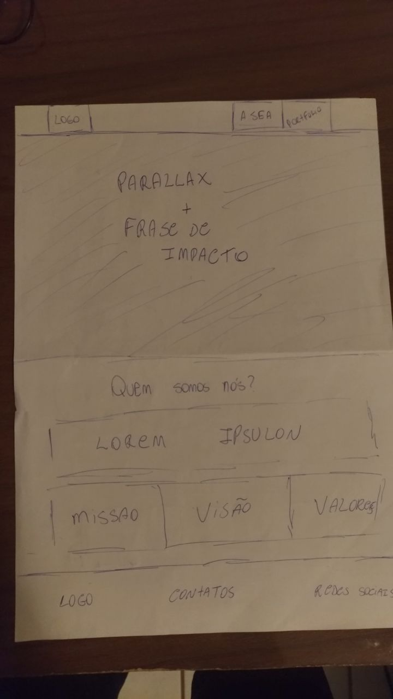
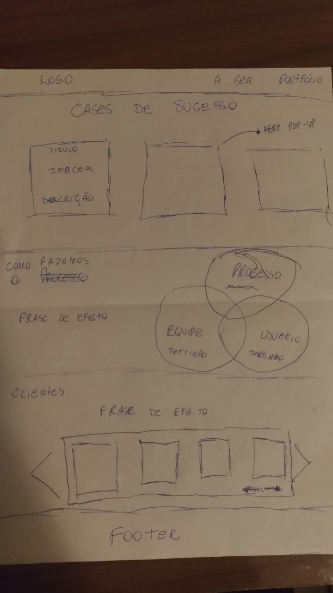
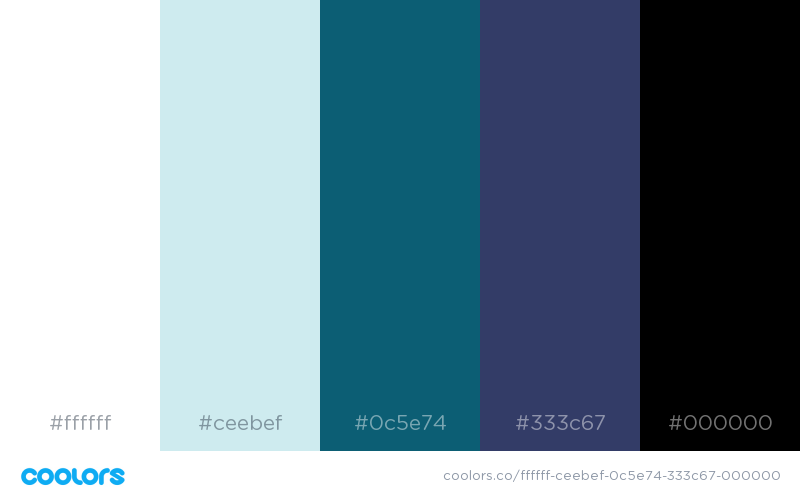

## Proceso de Criação 

***

### Esboços

A primeira parte do processo de criação foi o esboço de telas. Foi feito rapidamente um protótipo de baixar fidelidade para saber como seria a disposição dos elementos na tela e quais informações seriam disponibilizadas. Pode ser visto abaixo:

A primeira página apresenta um painel com Parallax assim que o usuário entra no site, mais abaixo apresenta o MVV (Missão, Visão e Valores) da empresa; e no rodapé temos informações de contato.

Nesta primeira página o usuário já pode ter uma noção básica da empresa.

A segunda página já apresenta informações mais claras para clientes em potencial, tais como: cases de sucesso, como é o processo e clientes ateriores.

A separação de telas foi escolhida para diminir a quantidade de informações que o usuário recebe ao navegar no site.

****

### Escolha da Paleta de Cores

A paleta de cores foi escolhida pensando na empresa, foram levados alguns pontos em consideração:

* Primeiramente as cores escolhidas devem ser relacionadas com a empresa em sí, por isso foram escolhidas cores marítimas.

* Considerando a natureza da empresa e dos clientes, foi escolhida uma paleta mais sóbria e elegante.

Como resultado obtive a paleta abaixo:

***

### Outras consideração:

- Não consegui achar logos vetorizadas, então tive que tirar printa das logos do site para poder usá-las, e por isso possuem disparidades de cores com o backgroud.

- A parte de cases de sucesso, não conheço nenhum outro projeto além do diário oficial da união, o qual foi falado durante a entrevista.

- Tive dificuldade em fazer o painel de rolagem em HTML puro, então foi apresentada apenas uma foto.